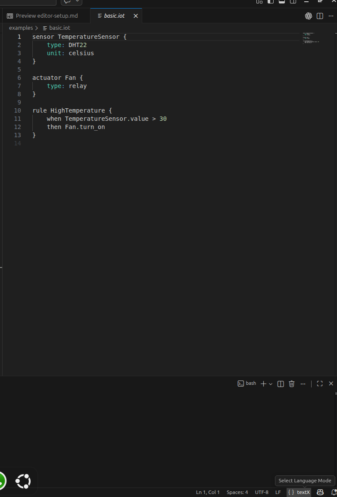

# Editor Setup Instructions (VS Code)

This document explains how to enable syntax highlighting and validation
for the IoTFlow DSL in VS Code.

------------------------------------------------------------------------

## 1. Create and Activate Python Environment

Create a new environment:

``` bash
conda create -n iotflow-wheel-test python=3.10
conda activate iotflow-wheel-test
```

Install the project in editable mode:

``` bash
pip install -e .
```

Verify installation:

``` bash
textx list-languages
```

You should see:

    iotflow (*.iot)

------------------------------------------------------------------------

## 2. Install textX VS Code Extension

Open VS Code Extensions and install:

-   **textX** (from Marketplace)

------------------------------------------------------------------------

## 3. Associate `.iot` Files with textX

Open VS Code settings (`settings.json`) and add:

``` json
{
  "files.associations": {
    "*.iot": "textx"
  }
}
```

Reload VS Code:

    Ctrl + Shift + P → Reload Window

------------------------------------------------------------------------

## 4. Verify Syntax Support

Open:

    examples/basic.iot

Check bottom-right corner in VS Code.

Language mode should display:

    textX

To validate file manually:

``` bash
textx check examples/basic.iot
```

Expected output:

    OK.

------------------------------------------------------------------------

## 5. Troubleshooting

If VS Code shows false errors:

-   Ensure correct Python interpreter is selected
-   Run `pip install -e .` again
-   Reload VS Code window
-   Check Output panel → Extension Host for errors

------------------------------------------------------------------------

If CLI validation works (`textx check`) but VS Code shows errors, the
issue is related to the VS Code extension configuration, not the DSL
itself.

------------------------------------------------------------------------

## Example: Editor Recognition

